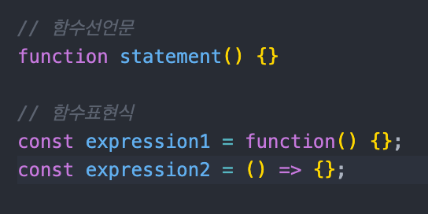

#### [back](../../README.md) &nbsp;&nbsp; | &nbsp;&nbsp; write by [Sangcho][sangcho]

# 12. 함수표현식에 타입 적용하기

<p align="center" style="width:500px; margin: 0 auto">
    
</p>

---

> 이 글은 이펙티브 타입스크립트를 참고하여 기록하였습니다.

<br>

## 1. 함수 표현식 vs 함수 선언식

<p align="center" style="width:400px; margin: 0 auto">
  
</p>

## 2. 함수 표현식을 사용해라

##### 1) 불필요한 코드의 반복을 줄일 수 있음.

```typescript
// 사칙연산함수
// 선언식
function add(a: number, b: number): number { return a + b; }
function sub(a: number, b: number): number { return a - b; }
function mul(a: number, b: number): number { return a * b; }
function div(a: number, b: number): number { return a / b; }

// 표현식
type BinaryFn = (a: number, b: number) => number;
const add: BinaryFn = (a, b) => a + b;
const sub: BinaryFn = (a, b) => a - b;
const mul: BinaryFn = (a, b) => a * b;
const div: BinaryFn = (a, b) => a / b;
```

##### 2) 시그니처가 일치하는 다른 함수가 있을 때도 함수 표현식에 타입을 적용하기 쉬움 (타입의 추론을 할 수 있게 해줌) 
> 시그니처:  어떤 인자를 받고, 무엇을 리턴하는지를 type으로 만들어 놓은 것 `ex) type addNumber = (arg2: number, arg1: number) => number;`

    - 67page 하단 부분 참고

## 3. 정리

1. 타입스크립트에서는 타입 재활용이라는 관점에서 함수 선언문보다 함수 표현식이 장점을 가짐.
2. 함수 표현식 전체 타입을 정의하는 것이 코드 간결, 안전함
3. 다른 함수의 시그니처와 동일한 타입을 가지는 새함수 또는 동일한 타입 시그니처를 가지는 여러개의 함수 작성 등 함수 전체의 타입 선언을 적용하기 쉬움.
4. 다른 함수의 시그니처를 참조하려면 typeof fn 을 사용.

---

<strong><참고자료></strong>

[책] [#이펙티브 타입스크립트][effective-typescript] - 댄 밴더캄 지음 -

---

##### 함수표현식에 타입 적용하기 end


[effective-typescript]: https://www.aladin.co.kr/shop/wproduct.aspx?ItemId=273193135&start=slayer
[sangcho]: https://github.com/SangchoKim
[taeHyen]: https://github.com/Tap-Kim
[kangHyen]: https://github.com/NacreousCloud
[sumin]: https://github.com/ttumzzi
