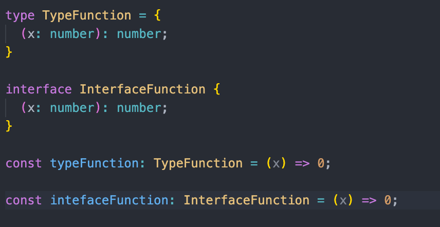

#### [back](../../../README.md) &nbsp;&nbsp; | &nbsp;&nbsp; write by [Sangcho](sangcho)

# 13.타입과 인터페이스의 차이점 알기

<p align="center" style="width:500px; margin: 0 auto">
    
</p>

---

> 이 글은 이펙티브 타입스크립트를 참고하여 기록하였습니다.

<br>

## 1. 타입과 인터페이스의 공통점

##### 1) 타입의 기본 동작

당연하게도 type과 interface 모두 변수에 타입의 할당하는 등의 기본적인 동작들은 잘 됩니다.

<p align="center" style="width:400px; margin: 0 auto">
  
</p>

##### 2) 인덱스 시그니처

인덱스 시그니처란 아래와 같이 생긴 형태를 의미합니다. 인덱스 시그니처에 관해서는 다음에 더 자세히 다루도록 하겠습니다.

<p align="center" style="width:400px; margin: 0 auto">
  
</p>

##### 3) 함수 타입 정의


<p align="center" style="width:400px; margin: 0 auto">
  
</p>

<p align="center" style="width:400px; margin: 0 auto">
  
</p>

- 타입과 인터페이스 모두 함수 타입을 정의할 수 있습니다.

- type과 interface 모두 함수 타입 선언 가능.

- type의 경우에는 이보다 더 간단하게 type alias로 만들 수 있습니다.

- type alias로 함수 타입 선언

##### 4) 제너릭 가능

<p align="center" style="width:400px; margin: 0 auto">
  
</p>

- type과 interface 모두 제너릭 사용 가능합니다.

- type과 interface 모두 제너릭 사용 가능.

##### 5) 타입 확장 가능

<p align="center" style="width:500px; margin: 0 auto">
  
</p>
<p align="center" style="width:500px; margin: 0 auto">
  
</p>

 - type, interface 모두 확장 가능하며 서로 확장 가능합니다.
 - 인터페이스는 유니온 타입 같은 복잡한 타입을 확장하지 못합니다. 
 - 만일 복잡한 타입을 확장하고 싶다면 타입과 '&'(인터섹션)을 사용해야 합니다.
- 복잡한 타입에는 type을 사용해야 한다.

##### 6) 클래스 구현 가능(implements)

<p align="center" style="width:500px; margin: 0 auto">
  
</p>

- 클래스를 구현(implements)할 때에는 type, interface 모두 사용 가능합니다

- type, interface 모두 class를 만들 때 구현(implements)할 수 있다.


## 2. 타입과 인터페이스의 차이점

##### 1) 유니온 개념의 유무

```jsx
type TypeAorB = "a" | "b"

interface InterfaceAorB {
  ...?
}
```

- type에는 유니온 타입이 있지만, interface에는 유니온 인터페이스가 없습니다.
- 또한, 앞서 언급한 것처럼 '&' 인터섹션 또한 존재하지 않습니다.
- 이로 인해 interface는 복잡한 타입을 만들어 낼 수 없습니다.

##### 2) 튜플과 배열 타입의 간결한 표현

<p align="center" style="width:500px; margin: 0 auto">
  
</p>

<p align="center" style="width:500px; margin: 0 auto">
  
</p>

- type 키워드를 이용하면 튜플과 배열 타입도 간결하게 표현할 수 있습니다.
- interface를 사용하게 되면 유사하게 만들 수 있으나 튜플의 프로토타입 체인 상에 있는 메서드들을 사용할 수 없습니다.
- type을 이용해서 만든 Tuple 타입. 여러 메서드들을 사용 가능.
- interface를 이용하여 만든 유사 트리플 타입. 다양한 메서드들을 사용할 수 없음.

##### 3) 선언 병합의 사용 가능 유무

<p align="center" style="width:500px; margin: 0 auto">
  
</p>

( [오픈소스인 bootstrap의 type 관련 파일](https://github.com/DefinitelyTyped/DefinitelyTyped/blob/master/types/bootstrap/index.d.ts) )

> 이 코드는 @type/bootstrap 패키지를 설치하게 되면 나오게 되는 bootstrap의 타입을 저장해놓은 코드입니다.첨부된 코드가 하는 내용은 기존의 글로벌 전역 변수에 있는 JQuery 타입과 Element 타입의 속성을 확장하고 있습니다.
JQuery나 Element 쪽의 라이브러리의 타입 코드를 수정하지 않고 bootstrap 쪽에서 필요한 속성을 추가하고 있습니다.

- 선언 병합을 통해서 interface의 속성을 확장 가능.
- 이를 통해 기존의 interface의 속성을 추가 가능.
- 선언 병합을 보강(augment)라고도 부름.
- 전역 변수를 추가할 때에도 유용하게 선언 병합을 사용 가능

## 3. 정리

1. type과 interface는 많은 부분에서는 큰 차이가 없음.
2. 복잡한 타입을 다룰 때는 type을 이용하는 것이 좋음.
3. 속성이 추가될 것을 고려하면 interface를 사용하는 것이 좋음

---

<strong><참고자료></strong>

[책] [#이펙티브 타입스크립트][effective-typescript] - 댄 밴더캄 지음 -

---

##### 타입과 인터페이스의 차이점 알기 end


[effective-typescript]: https://www.aladin.co.kr/shop/wproduct.aspx?ItemId=273193135&start=slayer
[sangcho]: https://github.com/SangchoKim
[taeHyen]: https://github.com/rlaxogus0517
[kangHyen]: https://github.com/bebekh1216
[sumin]: https://github.com/ttumzzi
