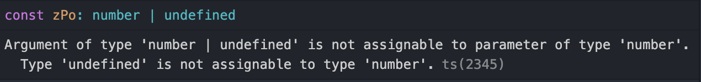

#### [back](../../README.md) &nbsp;&nbsp; | &nbsp;&nbsp; write by [Sangcho][sangcho]

# 24. 일관성 있는 별칭 사용하기

<p align="center" style="width:500px; margin: 0 auto">
    
</p>

---

> 이 글은 이펙티브 타입스크립트를 참고하여 기록하였습니다.

<br>

## 1. 별칭을 남발하면 제어 흐름을 분석하기 어렵다

***case 01*** 😍

```typescript
const doSomething = (b:number) => {};

type Point = {
    x: number;
    y: number;
    z?: number;
};

const poinst = {
    x:1, 
    y:2
}

function doSomethingWithPoint(point: Point) {
    const zPo = point.z;
    if(point.z) {
        doSomething(zPo);
    }
}
```

<p align="center" style="width:700px; margin: 0 auto">
  
</p>

- 해당 에러를 뿜는다.
- zPo 타입은 여전히 undfinded, number 타입의 유니온 타입이다.
- 속성 체크는 point.z 는 해주었지만, zPo 는 해주지 않았다.

```typescript
// Try 1
function doSomethingWithPoint(point: Point) {
    const zPo = point.z;
    if(point.z) {
        doSomething(point.z);
    }
}
```

- number 타입으로 좁혀졌음.
- 하지만 가독성에서 혼란을 줄 수 있는 코드이다. (zPo 와 point.z)

```typescript
// Try 2
function doSomethingWithPoint(point: Point) {
    const { z } = point;
    if(z) {
        doSomething(z);
    }
}
```

- 객체 비구조화를 사용하여 일관성 있는 변수를 사용
- 변수 식별자를 일관성있게 사용하는 것이 중요
<br/>

***case 02 런타임 혼동*** 🤭

```typescript
interface polygon {
    exterior: Coordinate[];
    holes: Coordinate[][];
    bbox?: BoundingBox;
}

const polygon: polygon = {exterior: [], holes: []};
function calculatePolygonBbox(polygon: polygon) {
    polygon.bbox = {x:[0,0], y:[0,0]};
}

const {bbox} = polygon;
if(!bbox) {
    calculatePolygonBbox(polygon);
    console.log(polyon.bbox, bbox);
    // {x:[0,0], y:[0,0]} undefined
}
```

- 런타임에도 혼동을 야기할 수 있음.

***case 03 제어 흐름 분석*** 🤭

```typescript
function fn(p: Polygon) { /* ... */ }

polygon.bbox // BoundingBox | undefined
if(polygon.bbox) {
    polygon.bbox;  // BoundingBox
    fn(polygon);  // fn 내부 구문에 따라 타입이 바뀔 수 있음.
    polygon.bbox;  // BoundingBox 
} 
```

- 흐름에 따라 타입이 바뀔 수 있음.

<br/>

## 3. 정리

1. 변수에 별칭을 사용할 때는 일관성 있게 사용.
2. 비구조화 문법을 사용하여 일관성 있는 변수를 사용.

---

<strong><참고자료></strong>

[책] [#이펙티브 타입스크립트][effective-typescript] - 댄 밴더캄 지음 -

---

##### 일관성 있는 별칭 사용하기 end

[effective-typescript]: https://www.aladin.co.kr/shop/wproduct.aspx?ItemId=273193135&start=slayer
[sangcho]: https://github.com/SangchoKim
[taeHyen]: https://github.com/Tap-Kim
[kangHyen]: https://github.com/NacreousCloud
[sumin]: https://github.com/ttumzzi
