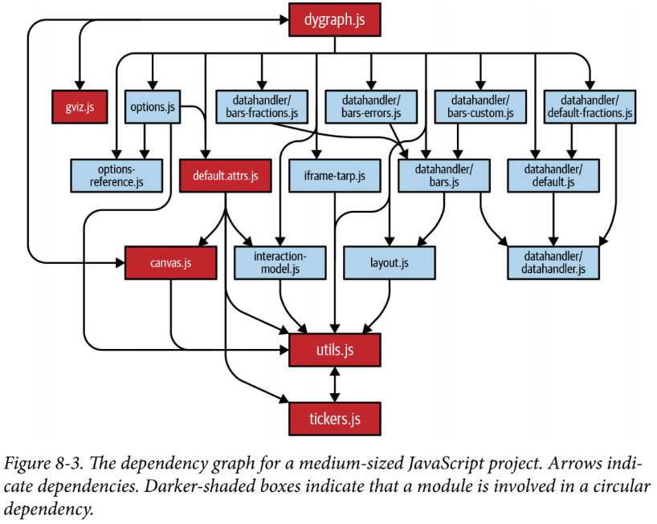

#### [back](../../../README.md) &nbsp;&nbsp; | &nbsp;&nbsp; write by [Sangcho](sangcho)

# 61. 의존성 관계에 따라 모듈 단위로 전환하기

<p align="center" style="width:500px; margin: 0 auto">
    
</p>

---

> 이 글은 이펙티브 타입스크립트를 참고하여 기록하였습니다.

<br>

## 1. 의존성과 관련된 오류 없이 작업하는 순서

**다른 모듈에 의존하지 않는 최하단 모듈부터 작업을 시작 -> 의존성의 최상단에 있는 모듈을 마지막으로 완성**

1. 서드파트 라이브러 타입 정보를 먼저 해결 -> @types/third-party 라이브러리 
2. 외부 API 타입 정보도 추가 필요 -> [아이템 35번][아이템 35번] 참고
3. 의존성이 있는 모듈을 하나씩 해결 (최하단 모듈 -> 최상위 모듈) -> madge 도구 사용하여 의존성 관계 파악 가능

<p align="center" style="width:500px; margin: 0 auto">
    
</p>

- util.js와 ticker.js가 순환 의존성을 가지고 있음을 알 수 있음.
- 최하단에 유틸리티 종류의 모듈이 위치하는 패턴을 발견하기 쉬움.

## 2. TS 전환시 오류 체크 - 선언되지 않은 클래스 멤버

```typescript
class Greeting {
    constructor(public name: string) {
        this.greeting = 'hello'; // 'Greenting' 클래스에 'greeting'이라는 멤버가 없음
        this.name = name; // 'Greenting' 클래스에 'name'이라는 멤버가 없음
    }
    greet() {
        return this.greeting + ' ' + this.name; // 'Greenting' 클래스에 'greeting', 'name'이라는 멤버가 없음
    }
}

-------------------------------------------------------------------

class Greeting {
    greeting: string;
    name: string;

    constructor(public name: string) {
        this.greeting = 'hello'; 
        this.name = name; 
    }
    greet() {
        return this.greeting + ' ' + this.name; 
    }
}

```

- 타입스크립트에서는 클래스의 멤버 변수를 선언하지 않으면 오류가 발생함.
- '누락된 모든 멤버 추가 (Add all missing members)'를 선택하면 타입을 추론하여 선언문이 추가됨.
- any로 추론된 속성은 직접 수정 필요

<br/>

## 3. TS 전환시 오류 체크 - 타입이 바뀌는 값

```typescript
const state = {};
state.name = 'New York'; // 'state'는 'name' 속성이 없습니다.
state.capital = 'Albany'; // 'state'는 'capital' 속성이 없습니다.

-------------------------------------------------------------------

const state = {
    name: 'New York',
    capital: 'Albany'
};

-------------------------------------------------------------------

interface State {
    name: string;
    capital: string;
}
const state = {} as State;
state.name = 'New York';
state.capital = 'Albany';
```

- 한꺼번에 객체를 생성하면 간단히 오류 해결 ([아이템 23번][아이템 23번])
- 어쩔수 없을 때에는 타입 단언문 사용 ([아이템 23번][아이템 23번])

<br/>

## 4. TS 전환시 오류 체크 - JSDoc와 @ts-check 사용시

```typescript

// javascript 일때 
@ts-check
/**
 * @param {number} num
 */
function double(num){
    return num * 2;
}
double('hello'); // 'hello'는 'number' 타입이 아닙니다.

-------------------------------------------------------------------

// typescript 변경 했을 때 
@ts-check
/**
 * @param {number} num
 */
function double(num){
    return num * 2;
}

double('hello'); // OK
-------------------------------------------------------------------

// typescript 변경 한후 JSDoc 주석 제거
function double(num: number){
    return num * 2;
}

double('hello'); // 'hello'는 'number' 타입이 아닙니다.
```

- javascript에서는 JSDoc 주석이 잘 동작함. 
- typescript로 변경하면 JSDoc 주석이 무시됨 -> number 타입이 any로 추론
- JSDoc 타입정보를 타입스크립트 타입으로 전환해 주는 기능 사용 -> 함수명의 마우스를 올렸을 때 기능 도출 
- 타입 정보고 생성된 이후 불필요한 JSDoc 주석은 제거하는 것이 좋음

<br/>

## 5. 정리

- 서드파티 모듈과 외부 API 호출에 대한 @type 추가 
- 의존성 관계도를 시각화하여 아래서부터 위로 올라가며 마이그레이션 하기
- 이상한 설계를 발견했을 시 리팩토링 하지않고 목록만 만들어 두기 
- 타입스크립트로 전환하면서 오류를 체크하고 수정하기

---

<strong><참고자료></strong>

[책] [#이펙티브 타입스크립트][effective-typescript] - 댄 밴더캄 지음 -

---

##### 의존성 관계에 따라 모듈 단위로 전환하기 end

[effective-typescript]: https://www.aladin.co.kr/shop/wproduct.aspx?ItemId=273193135&start=slayer
[sangcho]: https://github.com/SangchoKim
[taeHyen]: https://github.com/rlaxogus0517
[kangHyen]: https://github.com/bebekh1216
[sumin]: https://github.com/ttumzzi
[아이템 35번]: ./contents/04.타입설계/35.데이터가아닌API와명세를보고타입만들기.md
[아이템 23번]:  ./contents/03.타입추론/23.한꺼번에객체생성하기.md
